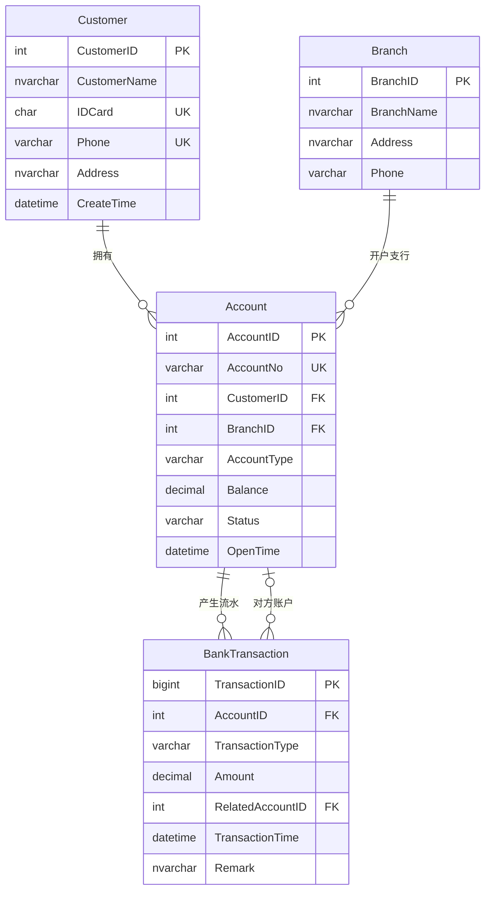

# 银行管理系统（SQL Server）

基于 SQL Server（T-SQL）实现的银行业务数据库，涵盖表结构设计、存储过程与事务控制、视图脱敏与最小权限、余额对账，以及索引性能验证。

> 本项目中的所有数据（姓名、身份证号、手机号、卡号等）均为虚构，仅用于学习演示。

## 技术点

- **数据完整性**：主键、外键、唯一约束、CHECK 约束（余额不能为负、金额必须大于 0、状态和类型枚举）
- **事务控制**：`BEGIN TRANSACTION` + `TRY/CATCH` + `THROW`，开启 `XACT_ABORT`，回滚前判断 `@@TRANCOUNT`
- **业务过程**：存款、取款、转账、开户、销户、冻结、解冻
- **视图与权限**：流水视图对身份证号、手机号脱敏；客服角色只能访问脱敏视图，不能直接查底表
- **数据核对**：对账 SQL 校验账户余额与流水累计一致
- **性能验证**：100 万条模拟流水上的索引对比实验（`STATISTICS IO` + 执行计划）

## 数据模型



| 表 | 说明 |
|---|---|
| Customer | 客户信息，身份证号、手机号唯一 |
| Branch | 支行信息 |
| Account | 银行账户，状态为 正常 / 冻结 / 注销，余额不能为负 |
| BankTransaction | 交易流水，类型为 存款 / 取款 / 转入 / 转出。转账产生两条流水，`RelatedAccountID` 指向对方账户，存款和取款为空 |

## 存储过程

| 存储过程 | 功能 | 主要校验 |
|---|---|---|
| `DepositMoney` | 存款 | 金额大于 0；账户存在且状态正常 |
| `WithdrawMoney` | 取款 | 金额大于 0；账户存在且状态正常；余额充足 |
| `TransferMoney` | 转账：同一事务内扣款、加款并写入转出、转入两条流水 | 金额大于 0；转出转入账户不同；两个账户均存在且状态正常；余额充足 |
| `OpenAccount` | 开户 | 客户、支行存在；账号不重复；账户类型合法；初始余额为 0
| `CloseAccount` | 销户（状态置为注销） | 账户存在；未注销；余额为 0 |
| `FreezeAccount` | 冻结账户 | 账户存在；未注销；未处于冻结状态 |
| `UnfreezeAccount` | 解冻账户 | 账户存在；未注销；当前为冻结状态 |

所有存储过程统一的异常处理方式：

```sql
SET XACT_ABORT ON;
BEGIN TRANSACTION;
BEGIN TRY
    -- 业务校验与数据修改
    COMMIT TRANSACTION;
END TRY
BEGIN CATCH
    IF @@TRANCOUNT > 0 ROLLBACK TRANSACTION;  -- 事务已被自动回滚时不再重复回滚
    THROW;                                     -- 把原始错误抛给调用方
END CATCH
```

## 视图与权限

| 视图 | 用途 | 内容 |
|---|---|---|
| `vw_AccountStatement` | 客服、分析等一般用户 | 证件号显示为 `440305********0055`，手机号显示为 `138****0005` |
| `vw_AccountStatement_internal` | 管理员、内部核实身份 | 完整证件号和手机号 |

权限演示（见 `sql/04_Queries.sql`）：只给测试用户 `csuser` 授予脱敏视图的查询权限。切换到该用户后，查视图正常返回脱敏数据，直接查 `Customer` 表会提示没有权限。

```sql
create user csuser without login;
grant select on vw_AccountStatement to csuser;

execute as user = 'csuser';
select * from vw_AccountStatement;   -- 能查，看到的是脱敏数据
select * from Customer;              -- 报错：没有权限
revert;
```

## 对账

校验每个账户的余额是否等于流水累计（存款、转入为加，取款、转出为减）。返回 0 行说明全部一致。

```sql
select a.AccountNo, a.Balance,
       isnull(sum(case when t.TransactionType in ('存款','转入') then t.Amount
                       when t.TransactionType in ('取款','转出') then -t.Amount end), 0) 流水合计
from Account a
left join BankTransaction t on t.AccountID = a.AccountID
group by a.AccountNo, a.Balance
having a.Balance <> isnull(sum(case when t.TransactionType in ('存款','转入') then t.Amount
                                     when t.TransactionType in ('取款','转出') then -t.Amount end), 0);
```

## 索引性能实验

脚本：`sql/05_IndexBenchmark.sql`。在独立的测试表 `BankTransaction_Test`（由 `select into` 创建的堆表）中生成 100 万条模拟流水，账户 ID 随机分布在 1 到 100000 之间，对比建立复合索引前后同一条查询的 I/O：

```sql
select * from BankTransaction_Test where AccountID = 12345 order by TransactionTime;
```

| | 建索引前 | 建索引后（`AccountID, TransactionTime`） |
|---|---|---|
| 逻辑读取（页） | 7463 | 15 |
| 扫描计数 | 11（并行全表扫描） | 1 |
| 返回行数 | 12 | 12 |

逻辑读取下降约 99.8%（约 500 倍）。数据由随机函数生成，重复执行时具体数字会略有出入。耗时受缓存影响较大，这里以逻辑读取作为对比指标。

正式表 `BankTransaction` 上已建立相同的索引：

```sql
create index IX_BankTransaction_Account_Time
    on BankTransaction (AccountID, TransactionTime);
```

## 运行方式

**环境**：SQL Server 2016 SP1 及以上（脚本使用了 `CREATE OR ALTER`），推荐使用 SSMS 执行。

**执行顺序**（需要在没有 `BankSystem` 库的全新环境中执行）：

| 顺序 | 文件 | 内容 |
|---|---|---|
| 1 | `sql/01_CreateTables.sql` | 建库、建表、建索引 |
| 2 | `sql/02_Procedures.sql` | 全部存储过程 |
| 3 | `sql/03_InsertData.sql` | 客户、支行、账户和测试流水 |
| 4 | `sql/04_Queries.sql` | 视图、权限演示和各类查询 |
| 可选 | `sql/05_IndexBenchmark.sql` | 索引实验，与业务数据相互独立 |


**示例调用**：

```sql
use BankSystem;

-- 存款、取款
exec DepositMoney  '6222000000020001', 500;
exec WithdrawMoney '6222000000020001', 200;

-- 转账
exec TransferMoney '6222000000020001', '6222000000020002', 100;

-- 按卡号查询流水（脱敏视图）
select * from vw_AccountStatement
where 本方卡号 = '6222000000020002'
order by 交易时间;
```

## 已知限制

- **转账加锁顺序未统一**：`TransferMoney` 固定先扣转出账户、再加转入账户，两笔方向相反的转账同时执行时可能发生死锁。可以按 `AccountID` 从小到大的顺序更新来避免。
- **并发下的余额检查**：取款和转账先读余额再更新，没有加锁。并发场景下由 `CHECK (Balance >= 0)` 兜底，不会透支，但此时抛出的是约束错误而不是"余额不足"。
- **流水字段较简单**：没有交易后余额，转账的两条流水之间也没有共同的转账编号。
- **流水视图使用左连接**：没有开户的客户也会出现在视图结果中，卡号和交易字段为空。
- **索引实验使用堆表**：测试表没有聚集索引，回表方式与正式表不同，结果用于说明索引效果，不代表生产环境的绝对数值。
